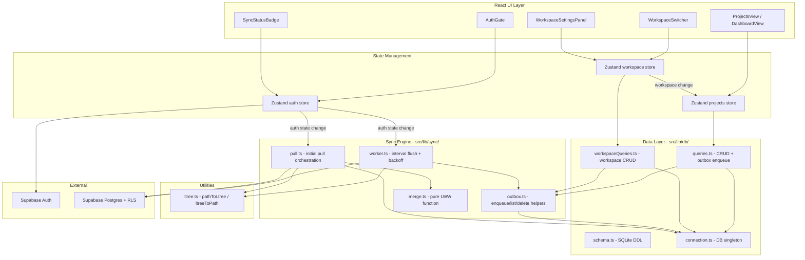

# Dokument Projektowy: Multi-Tenant Schema (Faza 5)

## Przegląd

Faza 5 rozszerza aplikację tracker (Tauri 2 + React 19 + SQLite + Supabase) o model multi-tenant oparty na **Workspace'ach**. Każdy zasób (`Resource`) i zdarzenie (`Event`) należy do dokładnie jednego Workspace. Użytkownik może tworzyć wiele Workspace'ów i zapraszać do nich innych użytkowników przez mechanizm Invite.

Kluczowe zmiany w stosunku do Fazy 4:

- **Model danych**: nowe tabele `workspaces` i `workspace_memberships` w SQLite i Postgres; kolumna `workspace_id` dodana do `resources` i `events`
- **ltree w Postgres**: migracja kolumny `path` z `TEXT` na typ `ltree` (rozszerzenie Postgres) z indeksem GiST; SQLite zachowuje dotychczasowy format materialized path (slash-separated UUIDs)
- **RLS na workspace_id**: polityki Row Level Security zastępują dotychczasowe `user_id = auth.uid()` nową funkcją pomocniczą `is_workspace_member(workspace_id)`
- **Workspace Invites**: tabela `invites` w Supabase, token UUID, 72h expiry, flow akceptacji
- **Workspace UI**: `WorkspaceSwitcher` w headerze, panel ustawień workspace
- **Sync**: outbox pattern rozszerzony o encje `workspace` i `workspace_membership`; Initial Pull pobiera workspace'y przed resources/events

**Kluczowe decyzje projektowe:**

- `Local_Personal_Workspace` dla trybu anonimowego — stabilne UUID generowane raz i przechowywane w SQLite, nigdy nie synchronizowane z Supabase
- `Personal_Workspace` tworzony automatycznie przy pierwszym logowaniu (name = `"My workspace"`)
- Walidacja nazwy workspace: 1–80 znaków (UI), kolumna DB: 1–255 znaków
- Invite flow: tylko Supabase (brak lokalnego SQLite dla invites) — invites są efemeryczne
- Usuwanie członka: najpierw Supabase, potem SQLite (nie przez outbox — operacja bezpośrednia)
- ltree konwersja: czyste funkcje `pathToLtree` / `ltreeToPath` w `src/lib/utils/ltree.ts`
## Architektura



**Przepływ danych — mutacja Workspace:**
1. Akcja użytkownika wywołuje metodę `WorkspaceStore` (np. `createWorkspace`)
2. Store wywołuje funkcję z `workspaceQueries.ts`
3. W jednej transakcji SQLite: zapis do tabeli `workspaces` + insert do `sync_outbox`
4. Store odświeża listę workspace'ów z SQLite
5. Worker pobiera wiersz outbox przy następnym tick → push do Supabase

**Przepływ danych — Initial Pull (po zalogowaniu):**
1. `onAuthStateChange` wywołuje `SIGNED_IN` / `INITIAL_SESSION`
2. `pull.ts` sprawdza czy Personal_Workspace istnieje w Supabase; jeśli nie — tworzy go
3. `pull.ts` pobiera Workspaces i WorkspaceMemberships (przed Resources/Events)
4. LWW merge dla workspace'ów → zapis do SQLite
5. `pull.ts` pobiera Resources i Events (z filtrem `workspace_id IN (...)`)
6. LWW merge dla resources/events → zapis do SQLite
7. Odbudowa materialized paths, przeliczenie `cached_minutes`
8. Odświeżenie stores → aktualizacja UI

**Przepływ danych — konwersja ltree:**
- **Push**: `pathToLtree(resource.path)` przed upsert do Supabase
- **Pull**: `ltreeToPath(cloudRow.path)` po pobraniu z Supabase

## Komponenty i Interfejsy

### Nowe typy (src/lib/db/types.ts — rozszerzenia)

```typescript
export interface Workspace {
  id: string;
  name: string;
  owner_id: string;
  created_at: number;
  updated_at: number;
  deleted_at: number | null;
}

export interface WorkspaceMembership {
  workspace_id: string;
  user_id: string;
  role: 'owner' | 'member';
  joined_at: number;
}

export interface Invite {
  id: string;
  workspace_id: string;
  invited_email: string;
  invited_by: string;
  token: string;
  created_at: string;
  expires_at: string;
  accepted_at: string | null;
}

export type OutboxEntity = 'resource' | 'event' | 'workspace' | 'workspace_membership';
```

### WorkspaceStore (src/store/workspace.ts)

```typescript
interface WorkspaceState {
  workspaces: Workspace[];
  memberships: WorkspaceMembership[];
  activeWorkspaceId: string | null;
  loading: boolean;
  error: string | null;

  activeWorkspace: () => Workspace | null;
  userWorkspaces: () => Workspace[];  // non-deleted, sorted by created_at asc

  init: (userId: string | null) => Promise<void>;
  createWorkspace: (name: string) => Promise<string>;
  renameWorkspace: (id: string, name: string) => Promise<void>;
  deleteWorkspace: (id: string) => Promise<void>;
  setActiveWorkspace: (id: string) => Promise<void>;
  restoreActiveWorkspace: (userId: string | null) => Promise<void>;
  removeMember: (workspaceId: string, userId: string) => Promise<void>;
  createInvite: (workspaceId: string, email: string) => Promise<Invite>;
  cancelInvite: (inviteId: string) => Promise<void>;
  listInvites: (workspaceId: string) => Promise<Invite[]>;
  acceptInvite: (token: string) => Promise<void>;
  refresh: () => Promise<void>;
}
```

Klucz localStorage: `tracker:activeWorkspaceId:{userId}` (authed) lub `tracker:activeWorkspaceId:anonymous` (anonymous).

### Zapytania Workspace (src/lib/db/workspaceQueries.ts)

```typescript
export function listWorkspaces(): Promise<Workspace[]>;
export function getWorkspace(id: string): Promise<Workspace | null>;
export function listMemberships(workspaceId: string): Promise<WorkspaceMembership[]>;
export function getUserMemberships(userId: string): Promise<WorkspaceMembership[]>;
export function createWorkspace(input: { id: string; name: string; ownerId: string }): Promise<void>;
export function renameWorkspace(id: string, name: string): Promise<void>;
export function softDeleteWorkspace(id: string): Promise<void>;
export function insertMembership(m: WorkspaceMembership): Promise<void>;
export function deleteMembership(workspaceId: string, userId: string): Promise<void>;
export function getOrCreateLocalWorkspace(): Promise<string>;
```

Kazda mutacja wykonywana w jednej transakcji SQLite: zapis do tabeli + insert do `sync_outbox`.

### Konwersja ltree (src/lib/utils/ltree.ts)

```typescript
/**
 * Konwertuje materialized path (slash-separated UUIDs) na format ltree.
 * Zamienia kazdy '-' na '_' i kazdy '/' na '.'.
 * @throws Error jesli input jest pusty lub zawiera niedozwolone znaki
 */
export function pathToLtree(path: string): string;

/**
 * Konwertuje ltree path z powrotem na materialized path.
 * Zamienia kazdy '_' na '-' i kazdy '.' na '/'.
 * @throws Error jesli input jest pusty lub zawiera niedozwolone znaki
 */
export function ltreeToPath(ltree: string): string;
```

### Rozszerzenia worker.ts

```typescript
// Entity rozszerzone o 'workspace' | 'workspace_membership'
// Nowa funkcja mapowania dla workspace (workspace nie ma pola user_id)
export function mapWorkspaceToCloud(data: Record<string, unknown>): Record<string, unknown>;
// Konwertuje created_at, updated_at, deleted_at z Unix ms na ISO 8601
// Tabele Supabase: 'workspaces' i 'workspace_memberships'
// workspace_membership z op='delete' -> supabase.from('workspace_memberships').delete()
```

### Rozszerzenia pull.ts

```typescript
// Nowa kolejnosc pobierania w runInitialPull:
// 1. ensurePersonalWorkspace(userId) - sprawdz/utworz Personal_Workspace w Supabase
// 2. Pobierz workspaces + workspace_memberships (przed resources/events)
// 3. LWW merge workspace'ow -> zapis do SQLite
// 4. Pobierz resources + events
// 5. LWW merge resources/events -> zapis do SQLite

export async function ensurePersonalWorkspace(userId: string): Promise<string>;
function cloudToLocalWorkspace(c: Record<string, unknown>): Workspace;
function cloudToLocalMembership(c: Record<string, unknown>): WorkspaceMembership;
```

### Komponenty UI

| Komponent | Lokalizacja | Odpowiedzialnosc |
|-----------|-------------|------------------|
| `WorkspaceSwitcher` | `src/components/Workspace/WorkspaceSwitcher.tsx` | Aktywny workspace; dropdown z lista + "New workspace" |
| `WorkspaceSettingsPanel` | `src/components/Workspace/WorkspaceSettingsPanel.tsx` | Nazwa, lista czlonkow, pending invites, formularz invite |
| `WorkspaceCreateModal` | `src/components/Workspace/WorkspaceCreateModal.tsx` | Modal tworzenia workspace z walidacja nazwy |
| `InviteAcceptView` | `src/components/Workspace/InviteAcceptView.tsx` | Widok akceptacji zaproszenia (token z URL) |

```typescript
// WorkspaceSwitcher — brak props, czyta z WorkspaceStore i AuthStore
// - anonymous: nazwa Local_Personal_Workspace (max 50 znakow), bez dropdown
// - authed, 1 workspace: nazwa, bez dropdown
// - authed, >1 workspace: dropdown z lista + "New workspace" na dole

interface WorkspaceSettingsPanelProps {
  workspaceId: string;
  onClose: () => void;
}
// Sekcje: nazwa (edytowalna dla owner), lista czlonkow, pending invites, formularz invite, Delete (owner only)
```

## Modele Danych

### Lokalne SQLite — nowe tabele i migracje

```sql
-- Nowe tabele (Faza 5)
CREATE TABLE IF NOT EXISTS workspaces (
  id          TEXT PRIMARY KEY,
  name        TEXT NOT NULL CHECK (length(name) BETWEEN 1 AND 255),
  owner_id    TEXT NOT NULL,
  created_at  INTEGER NOT NULL,
  updated_at  INTEGER NOT NULL,
  deleted_at  INTEGER
);
CREATE INDEX IF NOT EXISTS idx_workspaces_owner ON workspaces(owner_id);
CREATE INDEX IF NOT EXISTS idx_workspaces_active ON workspaces(deleted_at) WHERE deleted_at IS NULL;

CREATE TABLE IF NOT EXISTS workspace_memberships (
  workspace_id  TEXT NOT NULL REFERENCES workspaces(id) ON DELETE CASCADE,
  user_id       TEXT NOT NULL,
  role          TEXT NOT NULL CHECK (role IN ('owner', 'member')),
  joined_at     INTEGER NOT NULL,
  PRIMARY KEY (workspace_id, user_id)
);
CREATE INDEX IF NOT EXISTS idx_wm_user ON workspace_memberships(user_id);
```

**Migracja SQLite (jedna transakcja):**

```sql
BEGIN;

-- 1. Utworz tabele workspace (jesli nie istnieja)
CREATE TABLE IF NOT EXISTS workspaces ( ... );
CREATE TABLE IF NOT EXISTS workspace_memberships ( ... );

-- 2. Wstaw Local_Personal_Workspace
INSERT OR IGNORE INTO workspaces (id, name, owner_id, created_at, updated_at)
VALUES (:local_workspace_id, 'My workspace', :local_user_id, :now, :now);
INSERT OR IGNORE INTO workspace_memberships (workspace_id, user_id, role, joined_at)
VALUES (:local_workspace_id, :local_user_id, 'owner', :now);

-- 3. Dodaj workspace_id do resources (z backfill)
ALTER TABLE resources ADD COLUMN workspace_id TEXT REFERENCES workspaces(id) ON DELETE CASCADE;
UPDATE resources SET workspace_id = :local_workspace_id WHERE workspace_id IS NULL;

-- 4. Dodaj workspace_id do events (z backfill)
ALTER TABLE events ADD COLUMN workspace_id TEXT REFERENCES workspaces(id) ON DELETE CASCADE;
UPDATE events SET workspace_id = :local_workspace_id WHERE workspace_id IS NULL;

-- 5. Odtworz sync_outbox z rozszerzonym CHECK constraint
CREATE TABLE sync_outbox_new (
  id            INTEGER PRIMARY KEY AUTOINCREMENT,
  entity        TEXT NOT NULL CHECK (entity IN ('resource','event','workspace','workspace_membership')),
  entity_id     TEXT NOT NULL,
  op            TEXT NOT NULL CHECK (op IN ('upsert','delete')),
  payload       TEXT NOT NULL,
  enqueued_at   INTEGER NOT NULL,
  attempts      INTEGER NOT NULL DEFAULT 0,
  last_error    TEXT,
  next_retry_at INTEGER
);
INSERT INTO sync_outbox_new SELECT * FROM sync_outbox;
DROP TABLE sync_outbox;
ALTER TABLE sync_outbox_new RENAME TO sync_outbox;
CREATE INDEX IF NOT EXISTS sync_outbox_ready ON sync_outbox(next_retry_at);

COMMIT;
```

> SQLite nie obsluguje ALTER TABLE ... ALTER COLUMN ani ADD CONSTRAINT. Migracja workspace_id jest wykonywana przez ADD COLUMN (bez NOT NULL) z backfill; NOT NULL jest wymuszane przez walidacje w warstwie TypeScript.

### Supabase Postgres — nowe tabele i migracje

```sql
-- Migracja: 20260601000001_multi_tenant_schema.sql
BEGIN;

-- 1. Rozszerzenie ltree
CREATE EXTENSION IF NOT EXISTS ltree;

-- 2. Tabela workspaces
CREATE TABLE IF NOT EXISTS workspaces (
  id          UUID PRIMARY KEY,
  name        TEXT NOT NULL CHECK (length(name) BETWEEN 1 AND 255),
  owner_id    UUID NOT NULL REFERENCES auth.users(id) ON DELETE CASCADE,
  created_at  TIMESTAMPTZ NOT NULL,
  updated_at  TIMESTAMPTZ NOT NULL,
  deleted_at  TIMESTAMPTZ
);
CREATE INDEX IF NOT EXISTS workspaces_owner_idx ON workspaces(owner_id);

-- 3. Tabela workspace_memberships
CREATE TABLE IF NOT EXISTS workspace_memberships (
  workspace_id  UUID NOT NULL REFERENCES workspaces(id) ON DELETE CASCADE,
  user_id       UUID NOT NULL REFERENCES auth.users(id) ON DELETE CASCADE,
  role          TEXT NOT NULL CHECK (role IN ('owner', 'member')),
  joined_at     TIMESTAMPTZ NOT NULL,
  PRIMARY KEY (workspace_id, user_id)
);
CREATE INDEX IF NOT EXISTS wm_user_idx ON workspace_memberships(user_id);

-- 4. Backfill: Personal_Workspace dla uzytkownikow bez workspace
INSERT INTO workspaces (id, name, owner_id, created_at, updated_at)
SELECT gen_random_uuid(), 'My workspace', u.id, now(), now()
FROM auth.users u
WHERE NOT EXISTS (
  SELECT 1 FROM workspaces w WHERE w.owner_id = u.id AND w.deleted_at IS NULL
);

-- 5. Owner membership dla nowych workspace'ow
INSERT INTO workspace_memberships (workspace_id, user_id, role, joined_at)
SELECT w.id, w.owner_id, 'owner', now()
FROM workspaces w
WHERE NOT EXISTS (
  SELECT 1 FROM workspace_memberships wm
  WHERE wm.workspace_id = w.id AND wm.user_id = w.owner_id
);

-- 6. Dodaj workspace_id do resources
ALTER TABLE resources ADD COLUMN IF NOT EXISTS workspace_id UUID REFERENCES workspaces(id) ON DELETE CASCADE;
UPDATE resources r SET workspace_id = (
  SELECT w.id FROM workspaces w WHERE w.owner_id = r.user_id AND w.deleted_at IS NULL LIMIT 1
) WHERE r.workspace_id IS NULL;

-- 7. Dodaj workspace_id do events
ALTER TABLE events ADD COLUMN IF NOT EXISTS workspace_id UUID REFERENCES workspaces(id) ON DELETE CASCADE;
UPDATE events e SET workspace_id = (
  SELECT r.workspace_id FROM resources r WHERE r.id = e.resource_id LIMIT 1
) WHERE e.workspace_id IS NULL;

-- 8. Migracja ltree: path TEXT -> ltree (idempotentna)
DO $$ BEGIN
  IF (SELECT data_type FROM information_schema.columns
      WHERE table_name = 'resources' AND column_name = 'path') = 'text' THEN
    ALTER TABLE resources ALTER COLUMN path TYPE ltree USING path::ltree;
  END IF;
END $$;

-- 9. Indeks GiST na path
CREATE INDEX IF NOT EXISTS resources_path_gist_idx ON resources USING GIST (path);

-- 10. Tabela invites
CREATE TABLE IF NOT EXISTS invites (
  id              UUID PRIMARY KEY DEFAULT gen_random_uuid(),
  workspace_id    UUID NOT NULL REFERENCES workspaces(id) ON DELETE CASCADE,
  invited_email   TEXT NOT NULL,
  invited_by      UUID NOT NULL REFERENCES auth.users(id) ON DELETE CASCADE,
  token           UUID NOT NULL UNIQUE DEFAULT gen_random_uuid(),
  created_at      TIMESTAMPTZ NOT NULL DEFAULT now(),
  expires_at      TIMESTAMPTZ NOT NULL,
  accepted_at     TIMESTAMPTZ
);
CREATE INDEX IF NOT EXISTS invites_token_idx ON invites(token);
CREATE INDEX IF NOT EXISTS invites_workspace_idx ON invites(workspace_id);

COMMIT;
```

### Funkcja pomocnicza is_workspace_member

```sql
CREATE OR REPLACE FUNCTION is_workspace_member(p_workspace_id UUID)
RETURNS BOOLEAN LANGUAGE sql STABLE SECURITY DEFINER AS $$
  SELECT EXISTS (
    SELECT 1 FROM workspace_memberships
    WHERE workspace_id = p_workspace_id AND user_id = auth.uid()
  ) AND auth.uid() IS NOT NULL;
$$;
```

### Polityki RLS

```sql
ALTER TABLE workspaces            ENABLE ROW LEVEL SECURITY;
ALTER TABLE workspace_memberships ENABLE ROW LEVEL SECURITY;
ALTER TABLE invites                ENABLE ROW LEVEL SECURITY;

-- workspaces: dostep tylko dla czlonkow
DROP POLICY IF EXISTS "workspace_member_access" ON workspaces;
CREATE POLICY "workspace_member_access" ON workspaces
  FOR ALL USING (is_workspace_member(id)) WITH CHECK (is_workspace_member(id));

-- workspace_memberships: SELECT dla czlonkow; INSERT/DELETE tylko dla wlascicieli
DROP POLICY IF EXISTS "wm_select" ON workspace_memberships;
CREATE POLICY "wm_select" ON workspace_memberships
  FOR SELECT USING (is_workspace_member(workspace_id));

DROP POLICY IF EXISTS "wm_owner_write" ON workspace_memberships;
CREATE POLICY "wm_owner_write" ON workspace_memberships
  FOR ALL USING (
    EXISTS (SELECT 1 FROM workspace_memberships wm2
      WHERE wm2.workspace_id = workspace_memberships.workspace_id
        AND wm2.user_id = auth.uid() AND wm2.role = 'owner')
  );

-- resources: zastap stara polityke user_id nowa workspace_id
DROP POLICY IF EXISTS "own_resources" ON resources;
CREATE POLICY "workspace_resources" ON resources
  FOR ALL USING (is_workspace_member(workspace_id))
  WITH CHECK (is_workspace_member(workspace_id));

-- events: zastap stara polityke user_id nowa workspace_id
DROP POLICY IF EXISTS "own_events" ON events;
CREATE POLICY "workspace_events" ON events
  FOR ALL USING (is_workspace_member(workspace_id))
  WITH CHECK (is_workspace_member(workspace_id));

-- invites: INSERT/SELECT dla wlascicieli; UPDATE (accepted_at) dla zaproszonych
DROP POLICY IF EXISTS "invites_owner" ON invites;
CREATE POLICY "invites_owner" ON invites
  FOR ALL USING (
    EXISTS (SELECT 1 FROM workspace_memberships wm
      WHERE wm.workspace_id = invites.workspace_id
        AND wm.user_id = auth.uid() AND wm.role = 'owner')
  );

DROP POLICY IF EXISTS "invites_accept" ON invites;
CREATE POLICY "invites_accept" ON invites
  FOR UPDATE USING (
    invited_email = (SELECT email FROM auth.users WHERE id = auth.uid())
    AND accepted_at IS NULL AND expires_at > now()
  );
```

### Mapowanie typow SQLite <-> Postgres

| Pole | SQLite | Postgres | Konwersja Push | Konwersja Pull |
|------|--------|----------|----------------|----------------|
| `id` | TEXT (UUID) | UUID | passthrough | passthrough |
| `name` | TEXT | TEXT | passthrough | passthrough |
| `owner_id` | TEXT | UUID | passthrough | passthrough |
| `created_at` | INTEGER (Unix ms) | TIMESTAMPTZ | `new Date(ms).toISOString()` | `Date.parse(iso)` |
| `updated_at` | INTEGER (Unix ms) | TIMESTAMPTZ | `new Date(ms).toISOString()` | `Date.parse(iso)` |
| `deleted_at` | INTEGER or NULL | TIMESTAMPTZ or NULL | `ms ? new Date(ms).toISOString() : null` | `iso ? Date.parse(iso) : null` |
| `joined_at` | INTEGER (Unix ms) | TIMESTAMPTZ | `new Date(ms).toISOString()` | `Date.parse(iso)` |
| `workspace_id` | TEXT | UUID | passthrough | passthrough |
| `role` | TEXT | TEXT | passthrough | passthrough |
| `path` (resources) | TEXT (slash/UUID) | ltree | `pathToLtree(path)` | `ltreeToPath(path)` |

### Mapowanie ltree

| Format | Przyklad |
|--------|---------|
| Materialized Path (SQLite) | `550e8400-e29b-41d4-a716-446655440000/6ba7b810-9dad-11d1-80b4-00c04fd430c8` |
| ltree (Postgres) | `550e8400_e29b_41d4_a716_446655440000.6ba7b810_9dad_11d1_80b4_00c04fd430c8` |

Reguly konwersji: Push: `-` -> `_`, `/` -> `.'` | Pull: `_` -> `-`, `.` -> `/`

## Wlasciwosci Korekcyjne

*Wlasciwosc to cecha lub zachowanie, ktore powinno byc prawdziwe dla wszystkich poprawnych wykonan systemu. Wlasciwosci stanowia pomost miedzy czytelna dla czlowieka specyfikacja a weryfikowalnymi maszynowo gwarancjami poprawnosci.*

### Wlasciwosc 1: Round-trip konwersji ltree

*Dla kazdego* poprawnego ciagu materialized path (1-10 segmentow UUID v4 oddzielonych `/`), zastosowanie `pathToLtree` a nastepnie `ltreeToPath` powinno zwrocic oryginalny ciag bez zadnych zmian.

**Validates: Requirements 5.7, 12.3**

---

### Wlasciwosc 2: Poprawnosc konwersji pathToLtree

*Dla kazdego* poprawnego materialized path, wynik `pathToLtree` nie powinien zawierac znakow `-` ani `/`; kazdy `-` powinien byc zastapiony przez `_`, a kazdy `/` przez `.`.

**Validates: Requirements 5.3, 12.1**

---

### Wlasciwosc 3: Odrzucanie niepoprawnych danych przez pathToLtree i ltreeToPath

*Dla kazdego* ciagu wejsciowego, ktory jest pusty lub zawiera znaki inne niz dozwolone (odpowiednio: cyfry szesnastkowe, myslniki i ukosniki dla pathToLtree; cyfry szesnastkowe, podkreslenia i kropki dla ltreeToPath), funkcja powinna rzucic Error z opisem niepoprawnych znakow lub informacja o pustym wejsciu.

**Validates: Requirements 12.4, 12.5**

---

### Wlasciwosc 4: Walidacja nazwy workspace

*Dla kazdego* ciagu znakow, funkcja walidacji nazwy workspace powinna akceptowac go wtedy i tylko wtedy, gdy jego dlugosc wynosi od 1 do 80 znakow (po usunieciu wiodacych i koncowych bialych znakow); ciagi puste, zlozoone wylacznie z bialych znakow lub dluzsze niz 80 znakow powinny byc odrzucone.

**Validates: Requirements 3.1, 3.2**

---

### Wlasciwosc 5: Transakcyjnosc mutacji workspace

*Dla kazdej* operacji mutacji workspace (tworzenie, rename, soft-delete), po zakonczeniu operacji zarowno wiersz w tabeli `workspaces` w SQLite, jak i odpowiadajacy mu wiersz w `sync_outbox` powinny istniec i byc spojne — albo oba sa obecne, albo zaden (atomowosc transakcji).

**Validates: Requirements 3.1, 3.3, 7.1**

---

### Wlasciwosc 6: Niezmiennik owner membership

*Dla kazdego* workspace'u w tabeli `workspaces`, tabela `workspace_memberships` powinna zawierac dokladnie jeden wiersz z `role = 'owner'` dla `owner_id` tego workspace'u; niezmiennik ten powinien byc zachowany po kazdej operacji tworzenia workspace'u.

**Validates: Requirements 1.9, 2.2**

---

### Wlasciwosc 7: Idempotentnosc Local_Personal_Workspace

*Dla kazdej* liczby wywolan funkcji `getOrCreateLocalWorkspace()` (>= 1), wszystkie wywolania powinny zwracac ten sam UUID; UUID powinien byc generowany tylko raz i przechowywany w SQLite.

**Validates: Requirements 2.5**

---

### Wlasciwosc 8: Scopowanie zapytan do aktywnego workspace

*Dla kazdego* aktywnego workspace'u i dowolnego zestawu danych w SQLite zawierajacego resources z roznymi `workspace_id`, funkcja `listActiveResources` powinna zwracac wylacznie wiersze, ktorych `workspace_id` odpowiada aktywnemu workspace'owi.

**Validates: Requirements 4.5**

---

### Wlasciwosc 9: LWW Merge dla workspace'ow

*Dla kazdych* dwoch zbiorow wierszy workspace'ow (lokalnych i chmurowych), gdzie kazdy wiersz ma `id` i `updated_at`, algorytm LWW merge powinien: (a) wiersze istniejace tylko w chmurze umiescic w `writeSqlite`, (b) wiersze istniejace tylko lokalnie umiescic w `pushOutbox`, (c) przy konflikcie wybrac wiersz z wyzszym `updated_at`, (d) przy rownych `updated_at` nie umiescic wiersza w zadnym zbiorze wyjsciowym.

**Validates: Requirements 7.6**

---

### Wlasciwosc 10: Konwersja znacznikow czasu workspace

*Dla kazdego* poprawnego znacznika czasu Unix (dodatnia liczba calkowita w milisekundach), funkcja `mapWorkspaceToCloud` powinna produkowac obiekt, w ktorym `created_at` i `updated_at` sa poprawnymi ciagami ISO 8601 UTC; jesli `deleted_at` jest niezerowe, powinno byc rowniez skonwertowane na ISO 8601; jesli `deleted_at` jest null, powinno pozostac null.

**Validates: Requirements 7.4**

---

### Wlasciwosc 11: Walidacja emaila dla invite

*Dla kazdego* ciagu znakow, funkcja walidacji emaila dla invite powinna akceptowac go wtedy i tylko wtedy, gdy zawiera co najmniej jeden znak `@` i jego dlugosc nie przekracza 254 znakow; wszystkie inne ciagi powinny byc odrzucone.

**Validates: Requirements 8.1**

---

### Wlasciwosc 12: is_workspace_member — poprawnosc logiczna

*Dla kazdego* `workspace_id` i `user_id`, funkcja `is_workspace_member(workspace_id)` powinna zwracac `TRUE` wtedy i tylko wtedy, gdy `auth.uid()` jest niezerowe ORAZ w tabeli `workspace_memberships` istnieje wiersz z podanym `workspace_id` i `user_id = auth.uid()`; jesli `auth.uid()` jest null, funkcja powinna zwracac `FALSE`.

**Validates: Requirements 6.7**

---

### Wlasciwosc 13: Collapse duplikatow w outbox dla workspace

*Dla kazdej* listy wierszy outbox, w ktorej wiele wierszy ma te sama pare `(entity, entity_id)` (gdzie entity to `'workspace'` lub `'workspace_membership'`), funkcja `collapseDuplicates` powinna zachowac dokladnie jeden wiersz na unikalna pare — ten z najwyzszym `id` — i oznaczyc pozostale jako superseded do usuniecia.

**Validates: Requirements 7.1, 7.2**
