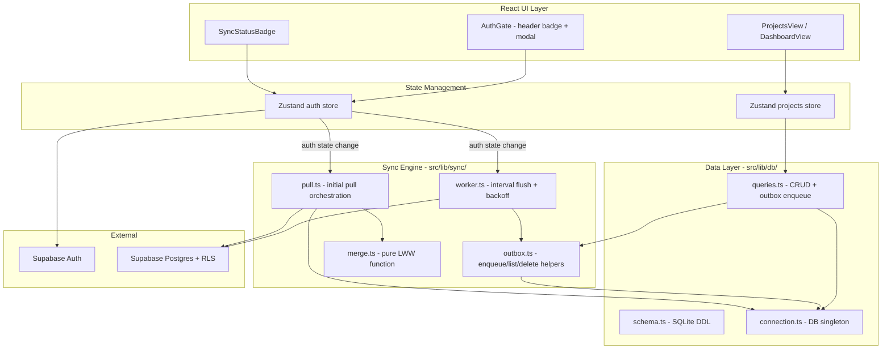

# Design Document: Supabase Cloud Sync

## Overview

This design adds optional Supabase-backed cloud synchronization to the existing local-first time-tracking desktop application. The system uses a transactional outbox pattern: every local SQLite mutation atomically enqueues a sync record, and a foreground TypeScript worker drains the outbox to Supabase Postgres in the background. On login, a one-shot pull with Last-Write-Wins (LWW) merge reconciles local and cloud state.

The feature is fully opt-in. Without Supabase environment variables, the app behaves identically to its offline-only mode. Authentication uses email/password via Supabase Auth with session persistence through localStorage in the Tauri WebView.

**Key Design Decisions:**
- Outbox engine in TypeScript (not Rust) — sufficient for single-user foreground app
- LWW merge per-row using `updated_at` timestamps — deterministic, simple conflict resolution
- Pull only on-login (no realtime subscription for MVP)
- Email confirmation disabled — reduces MVP friction
- Worker tick every 10s with visibility/focus triggers
- Batch size 50, collapse duplicates per `(entity, entity_id)`

## Architecture



**Data Flow — Mutation:**
1. User action triggers store method (e.g., `addProject`)
2. Store calls `queries.ts` function
3. Within a single SQLite transaction: write to entity table + insert outbox row
4. Store refreshes UI from SQLite
5. Worker picks up outbox row on next tick → pushes to Supabase

**Data Flow — Initial Pull (on login):**
1. `onAuthStateChange` fires `SIGNED_IN` / `INITIAL_SESSION`
2. `pull.ts` fetches all cloud rows for user (RLS-filtered)
3. `merge.ts` compares local vs cloud by `updated_at` (LWW)
4. Writes cloud-wins rows to SQLite, enqueues local-wins rows to outbox
5. Rebuilds materialized paths, recalculates `cached_minutes`
6. Refreshes projects store → UI updates

## Components and Interfaces

### Supabase Client (`src/lib/supabase.ts`)

```typescript
// Nullable singleton — null when env vars missing
export const supabase: SupabaseClient | null;
```

Returns `null` if `VITE_SUPABASE_URL` or `VITE_SUPABASE_ANON_KEY` are missing/empty. All sync components check for null before operating.

### Auth Store (`src/store/auth.ts`)

```typescript
type AuthState =
  | { kind: 'loading' }
  | { kind: 'anonymous' }
  | { kind: 'authed'; user: User; session: Session };

type SyncStatus =
  | { kind: 'idle' }
  | { kind: 'initial-pull' }
  | { kind: 'syncing' }
  | { kind: 'offline' }
  | { kind: 'error'; message: string };

interface AuthStore {
  state: AuthState;
  syncStatus: SyncStatus;
  pendingCount: number;
  lastSyncAt: number | null;
  init(): Promise<void>;
  signIn(email: string, password: string): Promise<void>;
  signUp(email: string, password: string): Promise<void>;
  signOut(): Promise<void>;
  setSyncStatus(s: SyncStatus): void;
  setPendingCount(n: number): void;
  setLastSyncAt(t: number): void;
}
```

**Lifecycle:**
- `init()` called at app boot → calls `getSession()` → sets state
- Subscribes to `onAuthStateChange` for token refresh and sign-out events
- Transitions trigger worker start/stop via Zustand subscription in `main.tsx`

### Outbox Helpers (`src/lib/sync/outbox.ts`)

```typescript
function enqueue(db: Database, entity: Entity, entityId: string, op: Op, data: Record<string, unknown>): Promise<void>;
function listReady(db: Database, now: number, limit?: number): Promise<ReadyRow[]>;
function deleteByIds(db: Database, ids: number[]): Promise<void>;
function bumpRetry(db: Database, ids: number[], errMsg: string, nowMs: number): Promise<void>;
function countPending(db: Database): Promise<number>;
function listRecentErrors(db: Database, limit?: number): Promise<ErrorRow[]>;
function clearAll(db: Database): Promise<void>;
function resetRetry(db: Database): Promise<void>;
```

### Sync Worker (`src/lib/sync/worker.ts`)

```typescript
function tick(): Promise<void>;      // Single flush cycle
function startWorker(): void;        // Start 10s interval + visibility listener
function stopWorker(): void;         // Clear interval + remove listener
```

**Tick algorithm:**
1. Guard: auth must be `authed`, `navigator.onLine` must be true
2. Select up to 50 ready rows from outbox
3. Collapse duplicates per `(entity, entity_id)` — keep highest ID
4. Group by entity type, upsert to Supabase with `user_id` injection + timestamp conversion
5. On success: delete flushed rows from outbox
6. On failure: bump retry with exponential backoff (cap 5 min)
7. Update `pendingCount` and `syncStatus` in auth store

### LWW Merge (`src/lib/sync/merge.ts`)

```typescript
interface MergeResult<T> {
  writeSqlite: T[];   // Cloud wins — write to local
  pushOutbox: T[];    // Local wins — enqueue for push
}

function lwwMerge<T extends { id: string; updated_at: number | string }>(
  local: T[],
  cloud: T[]
): MergeResult<T>;
```

Pure function. Compares each row by `updated_at` (converted to ms). Cloud-only → writeSqlite. Local-only → pushOutbox. Both exist → higher timestamp wins. Equal → no action.

### Pull Orchestrator (`src/lib/sync/pull.ts`)

```typescript
function initialPull(userId: string): Promise<void>;
```

Coordinates: fetch cloud data → merge → write SQLite → enqueue outbox → rebuild paths → recalc cached_minutes → reload store.

Tracks `hasPulledForUser: Set<string>` in-memory to avoid redundant pulls within same process.

### UI Components

| Component | Location | Responsibility |
|-----------|----------|----------------|
| `AuthGate` | `src/components/Auth/AuthGate.tsx` | Header badge: "Sign in" button or user email dropdown |
| `AuthModal` | `src/components/Auth/AuthModal.tsx` | Login/Signup tabs with validation |
| `SyncStatusBadge` | `src/components/Auth/SyncStatusBadge.tsx` | Visual sync state indicator |
| `SyncStatusModal` | `src/components/Auth/SyncStatusModal.tsx` | Error list + Retry/Clear actions |

### Timestamp Conversion Utilities

```typescript
// Push: SQLite ms → ISO 8601 UTC
function msToIso(ms: number): string {
  return new Date(ms).toISOString();
}

// Pull: ISO 8601 → SQLite ms
function isoToMs(iso: string): number {
  return Date.parse(iso);
}
```

## Data Models

### Local SQLite Schema (additions)

```sql
CREATE TABLE IF NOT EXISTS sync_outbox (
  id            INTEGER PRIMARY KEY AUTOINCREMENT,
  entity        TEXT NOT NULL CHECK (entity IN ('resource','event')),
  entity_id     TEXT NOT NULL,
  op            TEXT NOT NULL CHECK (op IN ('upsert','delete')),
  payload       TEXT NOT NULL,
  enqueued_at   INTEGER NOT NULL,
  attempts      INTEGER NOT NULL DEFAULT 0,
  last_error    TEXT,
  next_retry_at INTEGER
);
CREATE INDEX IF NOT EXISTS sync_outbox_ready ON sync_outbox(next_retry_at);
```

### Supabase Postgres Schema

```sql
CREATE TABLE resources (
  id             UUID PRIMARY KEY,
  user_id        UUID NOT NULL REFERENCES auth.users(id) ON DELETE CASCADE,
  parent_id      UUID REFERENCES resources(id) ON DELETE CASCADE,
  name           TEXT NOT NULL,
  type           TEXT NOT NULL CHECK (type IN ('project','stage','substage','task')),
  color          TEXT,
  path           TEXT NOT NULL,
  cached_minutes INTEGER NOT NULL DEFAULT 0,
  created_at     TIMESTAMPTZ NOT NULL,
  updated_at     TIMESTAMPTZ NOT NULL,
  deleted_at     TIMESTAMPTZ
);

CREATE TABLE events (
  id             UUID PRIMARY KEY,
  user_id        UUID NOT NULL REFERENCES auth.users(id) ON DELETE CASCADE,
  resource_id    UUID NOT NULL REFERENCES resources(id) ON DELETE CASCADE,
  date           DATE NOT NULL,
  minutes        INTEGER NOT NULL CHECK (minutes > 0),
  goal           TEXT,
  topics         TEXT,
  notes          TEXT,
  report         TEXT,
  created_at     TIMESTAMPTZ NOT NULL,
  updated_at     TIMESTAMPTZ NOT NULL,
  deleted_at     TIMESTAMPTZ
);
```

### Type Mapping (SQLite ↔ Postgres)

| Field | SQLite | Postgres | Push Conversion | Pull Conversion |
|-------|--------|----------|-----------------|-----------------|
| `created_at` | INTEGER (Unix ms) | TIMESTAMPTZ | `new Date(ms).toISOString()` | `Date.parse(iso)` |
| `updated_at` | INTEGER (Unix ms) | TIMESTAMPTZ | `new Date(ms).toISOString()` | `Date.parse(iso)` |
| `deleted_at` | INTEGER \| NULL | TIMESTAMPTZ \| NULL | `ms ? new Date(ms).toISOString() : null` | `iso ? Date.parse(iso) : null` |
| `date` (events) | TEXT (YYYY-MM-DD) | DATE | passthrough | passthrough |
| `user_id` | not present | UUID NOT NULL | injected from session | stripped on pull |
| `id` | TEXT (UUID string) | UUID | passthrough | passthrough |

### RLS Policies

```sql
-- Both tables: user can only access own rows
CREATE POLICY "own_resources" ON resources
  FOR ALL USING (user_id = auth.uid()) WITH CHECK (user_id = auth.uid());

CREATE POLICY "own_events" ON events
  FOR ALL USING (user_id = auth.uid()) WITH CHECK (user_id = auth.uid());
```

### TypeScript Types (additions to `src/lib/db/types.ts`)

```typescript
export type OutboxEntity = 'resource' | 'event';
export type OutboxOp = 'upsert' | 'delete';

export interface OutboxRow {
  id: number;
  entity: OutboxEntity;
  entity_id: string;
  op: OutboxOp;
  payload: string;
  enqueued_at: number;
  attempts: number;
  last_error: string | null;
  next_retry_at: number | null;
}
```

## Correctness Properties

*A property is a characteristic or behavior that should hold true across all valid executions of a system — essentially, a formal statement about what the system should do. Properties serve as the bridge between human-readable specifications and machine-verifiable correctness guarantees.*

### Property 1: LWW Merge Correctness

*For any* two sets of records (local and cloud) where each record has an `id` and `updated_at` timestamp, the LWW merge SHALL partition records such that: (a) records existing only in cloud appear in `writeSqlite`, (b) records existing only locally appear in `pushOutbox`, (c) records existing in both where cloud `updated_at` > local `updated_at` appear in `writeSqlite`, (d) records existing in both where local `updated_at` > cloud `updated_at` appear in `pushOutbox`, and (e) records with equal `updated_at` appear in neither output.

**Validates: Requirements 8.2, 8.3, 8.4, 8.5, 8.6**

### Property 2: LWW Merge Idempotence

*For any* valid set of local and cloud records, applying the merge function and then applying it again (using the merged result as the new local set against the same cloud set) SHALL produce an equivalent result — no additional records appear in either `writeSqlite` or `pushOutbox` on the second application.

**Validates: Requirements 8.10**

### Property 3: Timestamp Conversion Round-Trip

*For any* valid Unix millisecond timestamp (positive integer), converting to ISO 8601 UTC string via `new Date(ms).toISOString()` and back via `Date.parse(iso)` SHALL yield the original millisecond value. Additionally, a `null` deleted_at value SHALL remain `null` through the conversion.

**Validates: Requirements 7.1, 7.4**

### Property 4: Transactional Outbox Enqueue Integrity

*For any* resource or event mutation (create, rename, recolor, move, soft-delete), the resulting outbox row SHALL contain: `entity` matching the mutated table ('resource' or 'event'), `entity_id` matching the mutated row's UUID, `op` equal to 'upsert', a `payload` that is valid JSON and deserializes to an object matching the post-mutation row state, and `enqueued_at` as a positive integer Unix millisecond timestamp.

**Validates: Requirements 5.1, 5.2, 5.3, 5.4, 4.3, 14.5**

### Property 5: Duplicate Collapse Preserves Latest

*For any* list of outbox rows where multiple rows share the same `(entity, entity_id)` pair, the collapse function SHALL retain exactly one row per unique `(entity, entity_id)` — the one with the highest `id` value — and mark all other rows as superseded for deletion.

**Validates: Requirements 6.3**

### Property 6: Exponential Backoff Bounded

*For any* attempt count N ≥ 0, the computed backoff delay SHALL equal `min(2^(N+1) × 1000, 300000)` milliseconds, ensuring the retry delay never exceeds 5 minutes regardless of how many attempts have occurred.

**Validates: Requirements 6.5**

### Property 7: Cloud Data Mapping Injects User ID

*For any* valid outbox payload and authenticated user session, the `mapToCloud` function SHALL produce an object containing a `user_id` field equal to the session user's ID, while preserving all other data fields from the original payload.

**Validates: Requirements 7.2**

### Property 8: Invalid Timestamp Detection

*For any* outbox row where `created_at`, `updated_at`, or `deleted_at` contains a value that is not a positive integer (e.g., negative, zero, NaN, non-numeric string), the push logic SHALL skip that row and record a descriptive error in the outbox `last_error` field.

**Validates: Requirements 7.5**

### Property 9: Subtree Operations Enqueue All Affected Entities

*For any* resource tree of depth D with N total descendants, a soft-delete of the root SHALL produce exactly N+1 outbox rows for resources (root + all descendants) plus one outbox row for each event belonging to any resource in the subtree. Similarly, a move operation that changes K descendant paths SHALL produce at least K outbox rows for the modified descendants.

**Validates: Requirements 5.5, 5.6**

### Property 10: Email Validation

*For any* string, the email validation function SHALL accept the string if and only if it contains at least one `@` character AND its length is ≤ 254 characters. All other strings SHALL be rejected.

**Validates: Requirements 2.4**

### Property 11: Password Validation

*For any* string, the password validation function SHALL accept the string if and only if its length is ≥ 8 AND ≤ 128 characters. All other strings SHALL be rejected.

**Validates: Requirements 2.5**

### Property 12: Error Message Truncation

*For any* error message string, the stored `last_error` value in the outbox SHALL have length ≤ 1024 characters. If the original message exceeds 1024 characters, it SHALL be truncated to exactly 1024 characters.

**Validates: Requirements 6.6**

## Error Handling

### Network Errors

| Scenario | Handling |
|----------|----------|
| Offline during worker tick | Skip flush, set `syncStatus` to `offline`. Resume on next tick when online. |
| Supabase API error during flush | Increment `attempts`, compute backoff, store error in `last_error`. Retry on next eligible tick. |
| Network error during initial pull | Leave local data unchanged, set `syncStatus` to error with message. User can retry via modal. |
| Token expired mid-flush | `onAuthStateChange` fires `TOKEN_REFRESHED` → worker continues on next tick with new token. If refresh fails → `SIGNED_OUT` → worker stops. |

### Data Errors

| Scenario | Handling |
|----------|----------|
| Invalid timestamp in outbox payload | Skip row, record error in `last_error`. Row remains for manual inspection/clear. |
| Malformed JSON in payload | Skip row, record parse error. Should not occur if enqueue logic is correct. |
| RLS rejection (user_id mismatch) | Supabase returns 403 → treated as flush error → backoff. Indicates a bug in user_id injection. |
| Constraint violation on upsert | Supabase returns error → backoff. May indicate schema drift between local and cloud. |

### Auth Errors

| Scenario | Handling |
|----------|----------|
| signInWithPassword fails | Display Supabase error message inline in AuthModal. Do not close modal. |
| signUp fails | Display error inline. Common: "User already registered". |
| Session refresh fails | Transition to `anonymous`. Worker stops. Outbox preserved for next login. |
| getSession returns null on boot | Transition to `anonymous`. Normal anonymous-mode operation. |

### Outbox Overflow

- Worker batches LIMIT 50 per tick with duplicate collapse
- Backoff prevents hammering on persistent errors
- User can manually clear outbox via SyncStatusModal (with confirmation)
- Expected max outbox size for single user: < 1000 rows (typical usage patterns)

## Testing Strategy

### Test Framework Setup

- **Runner**: Vitest with happy-dom environment
- **Dependencies**: `vitest`, `@vitest/ui`, `happy-dom`, `@testing-library/react`
- **Config**: `vitest.config.ts` extending existing Vite config
- **Property testing**: `fast-check` library for property-based tests
- **Coverage target**: ≥ 80% for `src/lib/sync/`

### Property-Based Tests (fast-check)

Each correctness property maps to a single property-based test with minimum 100 iterations:

| Property | Test File | Key Generators |
|----------|-----------|----------------|
| 1: LWW Merge Correctness | `src/lib/sync/__tests__/merge.test.ts` | Random record sets with varying IDs and timestamps |
| 2: LWW Merge Idempotence | `src/lib/sync/__tests__/merge.test.ts` | Random record sets, apply merge twice |
| 3: Timestamp Round-Trip | `src/lib/sync/__tests__/worker.test.ts` | Random positive integers (1..2^53) |
| 4: Outbox Enqueue Integrity | `src/lib/sync/__tests__/outbox.test.ts` | Random resource/event mutations |
| 5: Duplicate Collapse | `src/lib/sync/__tests__/worker.test.ts` | Random outbox row lists with duplicate keys |
| 6: Backoff Bounded | `src/lib/sync/__tests__/worker.test.ts` | Random attempt counts (0..100) |
| 7: User ID Injection | `src/lib/sync/__tests__/worker.test.ts` | Random payloads + random UUIDs |
| 8: Invalid Timestamp Detection | `src/lib/sync/__tests__/worker.test.ts` | Random invalid values (negatives, strings, NaN) |
| 9: Subtree Enqueue | `src/lib/sync/__tests__/outbox.test.ts` | Random tree structures (depth 1-5, breadth 1-4) |
| 10: Email Validation | `src/components/Auth/__tests__/validation.test.ts` | Random strings with/without @ |
| 11: Password Validation | `src/components/Auth/__tests__/validation.test.ts` | Random strings of varying length |
| 12: Error Truncation | `src/lib/sync/__tests__/worker.test.ts` | Random strings of length 0..5000 |

**Tag format**: Each test tagged with comment:
```typescript
// Feature: supabase-cloud-sync, Property 1: LWW Merge Correctness
```

**Configuration**: Each property test runs minimum 100 iterations:
```typescript
fc.assert(fc.property(...), { numRuns: 100 });
```

### Unit Tests (Example-Based)

| Component | Test Focus |
|-----------|------------|
| `supabase.ts` | Client is null when env vars missing; warning logged |
| `auth store` | State transitions: loading → anonymous, loading → authed, authed → anonymous |
| `worker.ts` | Tick skips when anonymous; tick skips when offline; successful flush deletes rows; partial failure handles correctly |
| `pull.ts` | Pull triggered only once per user per process; pull failure leaves data unchanged |
| `outbox.ts` | listReady respects next_retry_at; countPending accuracy |

### Integration Tests

| Scope | Approach |
|-------|----------|
| Auth flow | Manual smoke test against real Supabase (signup → signin → signout → re-signin) |
| RLS isolation | Manual: two accounts, verify cross-user query returns empty |
| End-to-end sync | Manual: create project → verify appears in Supabase dashboard within 10s |
| Multi-device | Manual: login on device A, create data, login on device B, verify pull brings data |

### Test Mocking Strategy

- **SQLite**: In-memory database using `better-sqlite3` or mock `@tauri-apps/plugin-sql` interface
- **Supabase client**: Mock `supabase.from().upsert()` and `supabase.from().select()` responses
- **Navigator**: Mock `navigator.onLine` for offline tests
- **Timers**: Use Vitest fake timers for interval/timeout testing
- **Auth**: Mock `supabase.auth` methods (getSession, signInWithPassword, signUp, signOut, onAuthStateChange)

